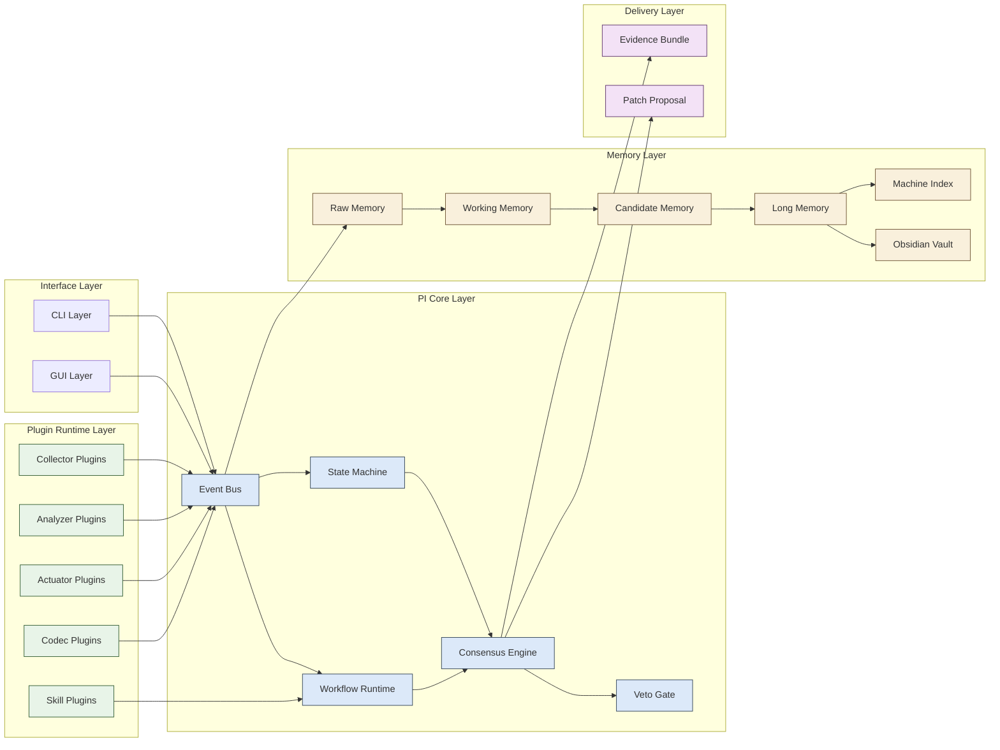
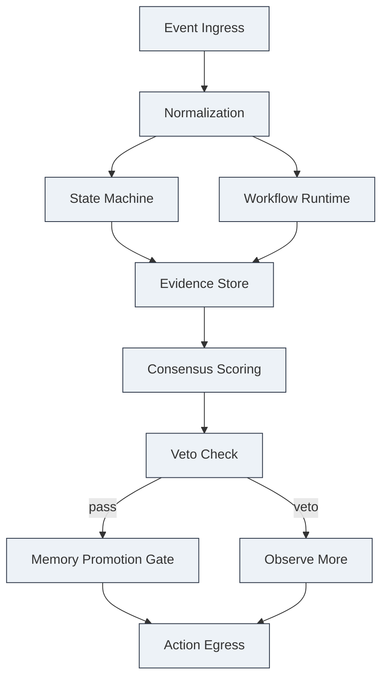
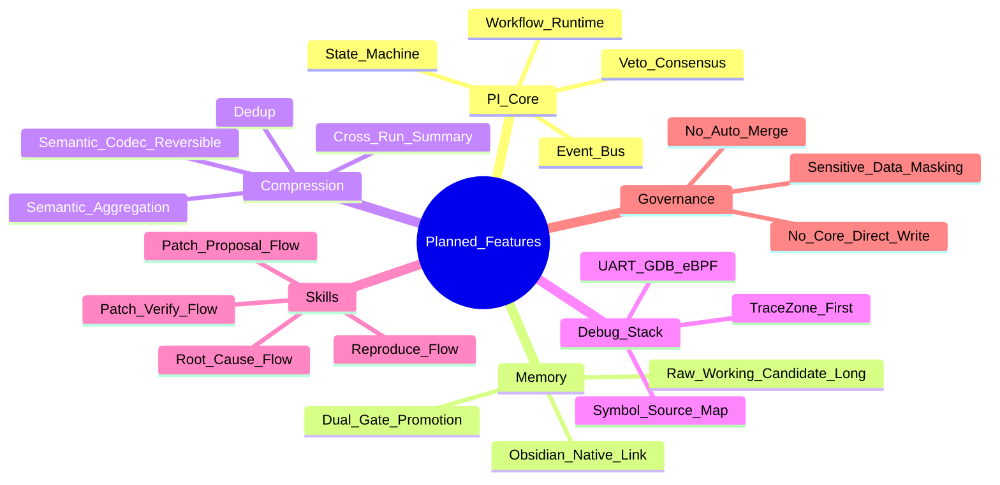

# Implementation Plan: IntelliDbgKit PI Core Debug Hub

**Branch**: `001-debug-loop` | **Date**: 2026-02-10 | **Spec**: `specs/001-debug-loop/spec.md`  
**Input**: Feature specification from `specs/001-debug-loop/spec.md`

## Summary

重構目標為建立「簡潔核心不汙染」的除錯中樞，並把 trace 轉成長期知識資產。  
本版以 PI Core 為核心，整合四層壓縮、雙條件記憶升級、技能化工作流、多 Agent 否決式收斂。  
GUI/CLI 同步使用同一事件與證據模型，CI 僅輸出 evidence bundle 與 patch proposal。

## Technical Context

**Language/Version**: Python 3.12（core/orchestrator/plugins）、TypeScript（GUI）  
**Primary Dependencies**: serialwrap, ubus-cli, gdb, bpftrace/libbpf, cscope/LSP backend, Copilot SDK  
**Storage**: Obsidian vault markdown + JSON index + JSONL raw events + Parquet aggregates  
**Testing**: unittest + schema contract + replay consistency + compression round-trip tests  
**Target Platform**: Host（Ubuntu/WSL）+ Target（prplOS/OpenWrt）  
**Project Type**: CLI + GUI + Plugin + Workflow Runtime（single repository）  
**Performance Goals**: 單次 P1 閉環 15 分鐘內；GUI 下鑽回應 < 2 秒  
**Constraints**: 行為/控制流 100%、統計 >= 80%、禁止 auto-merge、敏感資訊遮罩  
**Scale/Scope**: Phase 1 先支援單 board/單測項；Phase 2 擴展多 board/多 agent

## Constitution Check

*GATE: Must pass before Phase 0 research. Re-check after Phase 1 design.*

- Gate-1（核心邊界）: 插件不得直接寫 core state/long-memory，**PASS**。
- Gate-2（可追溯性）: 結論需可追溯到 `TraceEvent -> Evidence -> Consensus`，**PASS**。
- Gate-3（記憶治理）: 長記憶只允許雙條件升級，**PASS**。
- Gate-4（壓縮可逆）: 語意壓縮需具反譯機制，**PASS**。
- Gate-5（交付安全）: CI 僅提供 patch proposal，不做自動 merge，**PASS**。

## Architecture Visuals (Mermaid)

### 1) 系統分層架構圖



### 2) 核心方塊圖



### 3) 功能對照表



## Functional Capability Matrix

| Capability | Core Responsibility | Plugin Responsibility | Workflow Responsibility | Delivery |
|---|---|---|---|---|
| Trace 收集 | EventBus 接收與審計 | Collector 實際採集 | trace-capture-flow | raw events |
| 語意壓縮 | 壓縮規則驗證 | Codec 執行壓縮/反譯 | compression-flow | compact trace |
| Root cause | 收斂與否決 | Analyzer 證據生成 | root-cause-flow | consensus card |
| 記憶升級 | 雙條件判定 | Memory plugin 提交候選 | memory-promote-flow | long-memory note |
| 修正建議 | 風險與政策檢查 | Analyzer/Actuator 產草案 | patch-proposal-flow | patch proposal |

## Project Structure

### Documentation (this feature)

```text
specs/001-debug-loop/
├── plan.md
├── spec.md
├── research.md
├── data-model.md
├── quickstart.md
├── tasks.md
├── contracts/
│   ├── event-schema.json
│   ├── plugin-manifest.schema.json
│   ├── hlapi-discovery.schema.json
│   ├── hlapi-testcase.schema.json
│   ├── workflow.schema.json
│   ├── memory-promotion.schema.json
│   └── compression-lexicon.schema.json
├── testing/
│   └── hlapi-markdown-normalization.md
└── checklists/
    └── requirements.md
```

### Source Code (repository root)

```text
src/
├── core/
│   ├── state_machine.py
│   ├── event_bus.py
│   ├── workflow_runtime.py
│   ├── consensus_engine.py
│   └── veto_gate.py
├── plugins/
│   ├── collector/
│   ├── analyzer/
│   ├── actuator/
│   ├── skill/
│   └── codec/
├── memory/
│   ├── memory_store.py
│   ├── promotion_engine.py
│   ├── compression_codec.py
│   └── lexicon.py
├── adapters/
│   ├── command_intent.py
│   ├── provider_matrix.py
│   └── providers/
├── ingestion/
│   ├── xlsx_loader.py
│   └── hlapi_writer.py
├── report/
│   ├── evidence_bundle.py
│   └── patch_proposal.py
└── cli/
    └── commands/

gui/
├── src/
│   ├── timeline/
│   ├── graph/
│   └── drilldown/
└── tests/

tests/
├── contract/
├── integration/
└── unit/
```

## Phase 0: Research Focus

1. 四層壓縮 + 可逆反譯規則落地。
2. 長記憶雙條件升級門檻與誤判成本。
3. 多 Agent 加權與否決條件定義。
4. Skill/workflow 對 core 邊界的寫入治理。

## Phase 1: Design & Contracts

1. 更新核心 schema（event/plugin/workflow/memory/compression）。
2. 完成記憶生命周期與 promotion decision 模型。
3. 完成技能化 workflow 定義與阻塞條件。
4. 補齊 GUI 下鑽所需欄位與關聯。

## Complexity Tracking

| Violation | Why Needed | Simpler Alternative Rejected Because |
|-----------|------------|-------------------------------------|
| Workflow Runtime 內建核心 | 技能化流程需統一治理 | sidecar-only 容易造成流程分裂 |
| 四層壓縮 + 反譯 | 降噪且保證可追溯 | 單層摘要無法保留證據鏈 |
| 多 Agent 否決機制 | 降低錯誤確定性結論 | 純投票會掩蓋關鍵證據缺口 |
